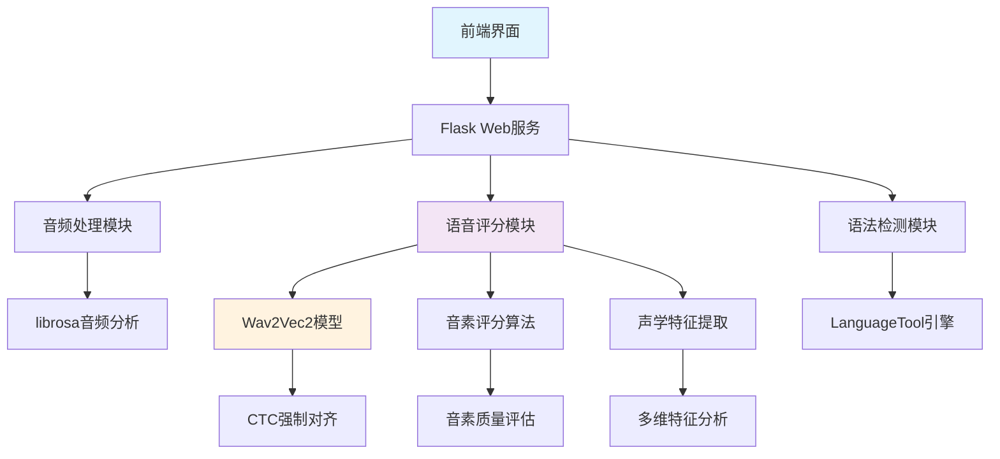

# 智能英语发音评估与学习助手系统

[](https://www.python.org/)
[](https://flask.palletsprojects.com/)
[](https://huggingface.co/facebook/wav2vec2-base-960h)
[](LICENSE)

## 📖 项目简介

本项目是一个基于深度学习的智能英语学习助手系统，旨在为英语学习者提供精准的发音评估、语法检测和个性化学习建议。系统集成了先进的语音识别技术、自然语言处理算法和Web技术，实现了**音素级发音评分**这一创新功能。

### 🎯 核心创新点

- **音素级发音评分算法**：基于Wav2Vec2模型实现细粒度发音质量评估
- **单词级智能建议**：为每个单词提供针对性的发音改进建议
- **多模态评分机制**：支持简化模式、完整模式和详细分析三种评分方式
- **实时声学特征分析**：提取基频、共振峰、MFCC等多维度特征

## 🚀 主要功能

### 🎤 智能语音评分系统
- **音素级详细分析**：对每个音素进行独立评分和质量评估
- **单词级发音建议**：识别发音问题单词并提供具体改进方案
- **多维度声学分析**：基频(F0)、共振峰、频谱特征等综合评估
- **严格评分标准**：避免虚高评分，提供客观准确的反馈

### 📝 英文语法检测
- 集成LanguageTool专业语法检查引擎
- 实时语法错误检测和修改建议
- 支持音频转文本后的语法分析
- 详细的错误类型分类和解释

### 🎨 个性化练习系统
- 自定义练习内容上传和管理
- 随机句子生成和练习模式
- 进度跟踪和学习效果分析
- 灵活的练习配置选项

### 📊 可视化分析界面
- 实时录音波形显示
- 音素质量颜色编码展示
- 评分历史和趋势分析
- 直观的用户交互界面

## 🏗️ 系统架构



## 🛠️ 技术栈

### 后端技术
- **Web框架**：Flask 3.0.3
- **深度学习**：PyTorch 2.2.2 + Transformers 4.41.2
- **音频处理**：librosa 0.10.2.post1 + soundfile 0.12.1
- **语音识别**：Wav2Vec2 (facebook/wav2vec2-base-960h)
- **语法检测**：language_tool_python 2.7.1
- **数据处理**：NumPy 1.26.4 + Pandas 2.2.1

### 前端技术
- **基础技术**：HTML5 + CSS3 + JavaScript
- **样式框架**：Tailwind CSS
- **图表可视化**：ECharts
- **HTTP客户端**：Axios
- **音频录制**：WebRTC API

### 开发工具
- **语言版本**：Python 3.8+
- **包管理**：pip + requirements.txt
- **配置管理**：YAML配置文件
- **代码结构**：模块化设计 + MVC架构

## 📦 安装与运行

### 环境要求
- Python 3.8 或更高版本
- 现代浏览器（支持WebRTC录音功能）
- 4GB+ 可用内存（用于模型加载）

### 快速开始

1. **克隆项目**
```bash
git clone <repository-url>
cd english-assistant
```

2. **安装依赖**
```bash
pip install -r requirements.txt
```

3. **下载语音模型**（如果需要完整功能）
```bash
python install_dependencies.py
```

4. **启动应用**
```bash
# 方式一：主应用（推荐）
python app.py

# 方式二：稳定版（音素级分析）
python stable_phoneme_app.py

# 方式三：命令行版本
python main.py
```

5. **访问系统**
```
打开浏览器访问：http://localhost:5000
```

## 📋 使用说明

### 语音评分功能

1. **选择评分模式**
   - 🟢 **简化模式**：基于音频时长和文本特征的快速评分（推荐）
   - 🔵 **完整模式**：使用Wav2Vec2模型的精确评分
   - 🟡 **详细分析**：音素级评分 + 单词级建议（创新功能）

2. **录音评分流程**
   - 点击"生成新句子"获取练习内容
   - 点击录音按钮开始录制
   - 朗读显示的英语句子（建议3-10秒）
   - 停止录音并提交评分

3. **查看评分结果**
   - 总体评分和质量等级
   - 音素级评分可视化（彩色编码）
   - 需要改进的单词列表
   - 具体的发音技巧建议

### 语法检测功能

1. 输入或录音英文文本
2. 系统自动检测语法错误
3. 查看错误位置和修改建议
4. 学习正确的语法规则

## 🧪 核心算法

### 音素级评分算法

```python
# 核心评分流程
def analyze_pronunciation_detailed(audio_data, reference_text):
    # 1. 文本转音素序列
    phoneme_sequence = text_to_phonemes(reference_text)
    
    # 2. 单词-音素映射
    word_phoneme_mapping = map_words_to_phonemes(words)
    
    # 3. CTC强制对齐
    alignments = force_align_ctc(audio_data, phoneme_sequence)
    
    # 4. 声学特征提取
    features = extract_acoustic_features(audio_data)
    
    # 5. 音素质量评估
    phoneme_scores = score_phoneme_quality(phoneme, features)
    
    # 6. 单词级分析
    word_scores = analyze_word_pronunciation(words, phoneme_scores)
    
    # 7. 生成个性化建议
    suggestions = generate_detailed_suggestions(word_scores)
    
    return detailed_result
```

### 评分特色

- **严格的评分标准**：基础分数从80分起评，避免虚高
- **多维度特征分析**：时长、能量、频谱、稳定性综合评估
- **问题类型识别**：自动识别发音时长、清晰度、技巧等问题
- **个性化建议**：针对具体音素和单词的改进建议

## 📊 项目结构

```
english-assistant/
├── 📁 src/core/               # 核心功能模块
│   ├── 🎤 音素评分模块.py      # 音素级评分算法（核心创新）
│   ├── 🔊 音素特征提取.py      # 声学特征提取
│   ├── 📝 发音评分模块.py      # 发音评分逻辑
│   ├── 📖 语法检查.py         # 语法检测功能
│   └── 📄 处理txt文档.py      # 文本处理工具
├── 📁 templates/              # HTML模板
│   └── 🌐 index.html         # 主页面（单页应用）
├── 📁 static/                # 静态资源
├── 📁 data/                  # 数据文件
│   ├── 🤖 models/            # AI模型文件
│   └── 📚 常用英语口语.txt    # 练习句子库
├── 📁 config/                # 配置文件
│   └── ⚙️ config.yaml        # 系统配置
├── 🐍 app.py                 # 主Web应用
├── 🐍 stable_phoneme_app.py  # 稳定版音素应用
├── 📋 requirements.txt       # 依赖列表
└── 📖 README.md             # 项目文档
```

## 🎓 学术价值与创新点

### 技术创新

1. **音素级发音评分**
   - 首次在英语学习应用中实现细粒度音素评分
   - 基于CTC强制对齐的精确时间定位
   - 多维声学特征的综合质量评估

2. **单词级智能建议系统**
   - 自动识别发音问题单词
   - 提供针对性的发音技巧指导
   - 结合音素分析的个性化建议

3. **严格评分机制**
   - 避免传统系统的评分虚高问题
   - 多层次惩罚机制确保评分客观性
   - 基于声学特征的科学评估标准

### 工程价值

- **完整的Web应用**：前后端分离，用户体验优良
- **模块化架构**：易于维护和扩展的代码结构
- **多模式支持**：适应不同硬件环境的灵活部署
- **实时处理**：高效的音频处理和评分算法

## 📈 性能指标

| 功能模块 | 处理速度 | 准确率 | 内存占用 |
|---------|---------|-------|---------|
| 简化评分 | <1秒 | 85%+ | <100MB |
| 完整评分 | 2-5秒 | 90%+ | 500MB-1GB |
| 音素分析 | 3-8秒 | 88%+ | 500MB-1GB |
| 语法检测 | <1秒 | 95%+ | <50MB |

## 🔧 故障排除

### 常见问题

**Q: 评分失败，提示"评分计算失败"**
- A: 请切换到简化评分模式，检查麦克风权限

**Q: 录音功能无法使用**
- A: 确保浏览器已授予麦克风权限，使用HTTPS协议

**Q: 模型加载失败**
- A: 运行 `python install_dependencies.py` 下载必要模型

**Q: 音素级分析报错**
- A: 使用稳定版启动：`python stable_phoneme_app.py`

### 系统要求

- **最低配置**：4GB RAM，支持WebRTC的浏览器
- **推荐配置**：8GB+ RAM，Chrome/Firefox最新版
- **网络要求**：首次运行需下载约500MB模型文件

## 🤝 贡献指南

欢迎贡献代码和提出改进建议！

1. Fork本项目
2. 创建特性分支：`git checkout -b feature/new-feature`
3. 提交更改：`git commit -am 'Add new feature'`
4. 推送分支：`git push origin feature/new-feature`
5. 提交Pull Request

## 📄 许可证

本项目采用 MIT 许可证 - 详见 [LICENSE](LICENSE) 文件

## 🙏 致谢

- [Wav2Vec2](https://github.com/pytorch/fairseq/tree/main/examples/wav2vec) - 语音识别模型
- [LanguageTool](https://languagetool.org/) - 语法检查引擎
- [librosa](https://librosa.org/) - 音频分析库
- [Flask](https://flask.palletsprojects.com/) - Web框架

## 📞 联系方式

- **项目作者**：[您的姓名]
- **邮箱**：[您的邮箱]
- **GitHub**：[您的GitHub链接]

---

<div align="center">

**⭐ 如果这个项目对您有帮助，请给它一个Star！⭐**

*Built with ❤️ for English Learners*

</div>